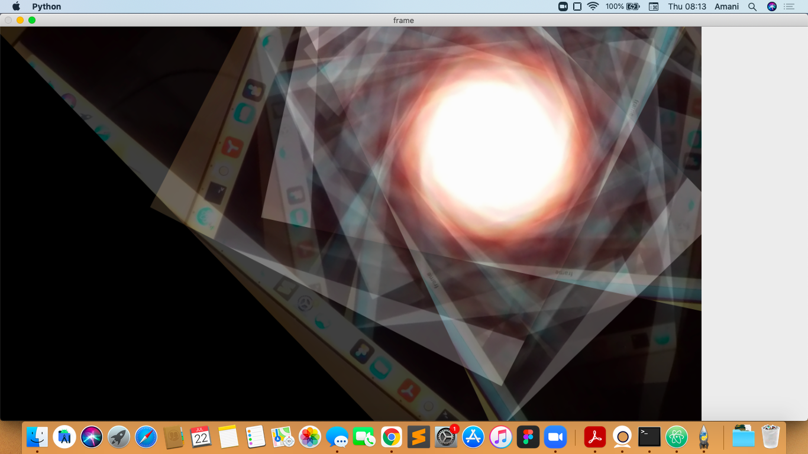
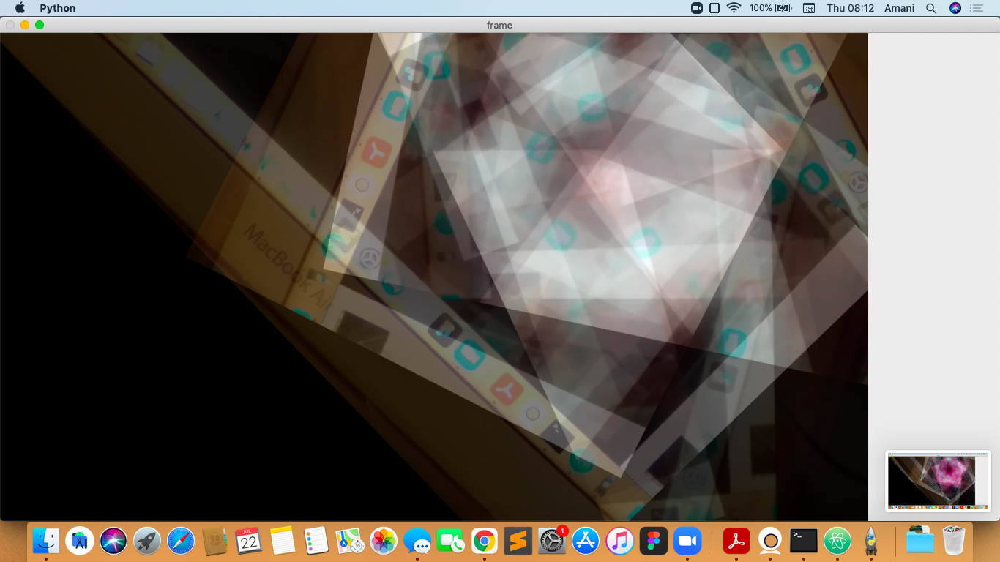

# Analog-Fractals

This is a small demo inspired by [CodeParade](https://www.youtube.com/watch?v=Pv26QAOcb6Q&ab_channel=CodeParade).

Uses:
Opencv: version 4.5.1
NumPy: version 1.20.2

You can modify it as you like!

